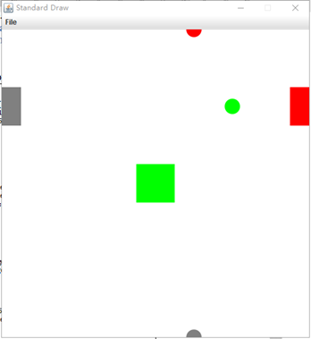
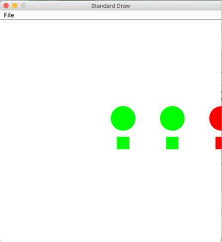

# Tutorial of Inheritance

> Based on the tutorial of "2020S-Java-A" designed by teaching group in SUSTech(Designed by ZHAO Yao)
>
> Modified (only change to markdown file) by ZHU Yueming in 2021. April. 25th

## Objective

-  Learn inheritance.
-  Learn protected keyword.
-  Learn polymorphism

## Part 1: Inheritance

### 1. Before Exercise

#### 1.1 Download resource

download source code (source-code-of-inheritance.zip) of inheritance in sakai website. Place all java files at the same location.

 #### 1.2 Source code analysis

From the source code, it is observed that the two classes: Circle and Rectangle have a lot of common fields, e.g., ```screenSize```, ```x```, ```y``` and ```ShapeColor```, and a lot of similar methods. It is a good time to practice inheritance by refactoring the code. 

The idea of inheritance is simple but powerful: When you want to create a new class and there is an existing class which includes some of the code that you want, you can extend your new class from the existing class. In doing this, you can reuse the fields and methods of the existing class without having to write (and debug!) them yourself.

A subclass inherits all the members (fields, methods, and nested classes) from its superclass. Constructors are not members, so they are not inherited by subclasses, but the subclass must invoke one of the constructors in its superclass.

(https://docs.oracle.com/javase/tutorial/java/IandI/subclasses.html )

We found that, the attributes **x**, **y**, **color** and **screenSize** are both in **Circle** and **Rectangle**, then for those common attributes are more appropriated to be extracted into a super class named **Shape**, from which the subclass can use all attributes and methods.

#### 1.3 Create a super class

Create a class ```Shape```, which contains following members:

- Adding attributes

  ```java
  private double x;
  private double y;
  private ShapeColor color = ShapeColor.GRAY;
  private static int screenSize = 10;
  ```

- Refactoring ```CircleColor``` to ```ShapeColor```

  <font color='RED'>1. Right click the class name ```CircleColor```</font>

  <font color='RED'>2. Click Refactor -> Rename</font>

  <font color='RED'>3. Then Rename it to ShapeColor</font>

- Adding constructors with two parameter ```x``` and ```y```

  ```java
  public Shape(double x, double y) {
      this.x = x;
      this.y = y;
  }
  ```

- Adding getter/setter method of all attributes.

- Adding ```toString()``` method (override the method of the Object class) to output the property of the Shape object; 

  ```java
  @Override
  public String toString() {
      return " x=" + x + ", y=" + y + ", color=" + color;
  }
  ```

#### 1.4 Modify subclass

- Now, modify class Circle. Let it inherit class Shape by using the keyword extends.

```java
public class Circle extends Shape
```

- Remove those methods and attributes which can be inherited from class Shape.

  Now class Circle only needs to define two specific attributes: radius and DEFAULT_RADIUS.

  ```java
  private double radius;
  private static final int DEFAULT_RADIUS = 5;
  ```

- Modify the constructor of class Circle as follows and use ```super ()```.

  **this** serves as the current object, while **super** serves as the only supper class for current object.

  ```java
    public Circle(double radius, double x, double y) {
          super(x,y);
          this.radius = radius;
      }
  
      public Circle(double radius) {
          super(0,0);
          this.radius = radius;
      }
  
      public Circle(double x, double y) {
          super(x,y);
          this.radius = DEFAULT_RADIUS;
      }
  ```

#### 1.5 Access the instance fields and static fields of super class in a subclass.

We will find that some errors occur in other methods, for example:

- Change **Circle.screenSize** to **Shape.getScreenSize()** since screenSize is a private static field.

- Change **this.x** to **super.getX()** since x is a private field of supper class, and so on. 

  ```java
  public boolean isInBoundary() {
          if (-1 * Shape.getScreenSize() > super.getX()- this.radius || Shape.getScreenSize()  < super.getX() + this.radius) {
              return false;
          }
          if (-1 * Shape.getScreenSize()  > super.getY()- this.radius || Shape.getScreenSize() <super.getY()- + this.radius) {
              return false;
          }
          return true;
      }
  ```

  Change other methods in the same way.

#### 1.6 **protected keyword**

We can find that Circle is inconvenient to access the private attributes of superclass, so we can consider making these frequent-used attributes accessible to subclass. **Protected** can help us.

- Change **x, y** and **color** from **private** to **protected**. 

- Then we change the ```isInBoundary()``` back to the original one except ```Shape.getScreenSize()```, it can work well .

  ```java
  public boolean isInBoundary() {
          if (-1 * Shape.getScreenSize() > x - this.radius || Shape.getScreenSize() < x + this.radius) {
              return false;
          }
          if (-1 * Shape.getScreenSize() > y - this.radius || Shape.getScreenSize() < y - +this.radius) {
              return false;
          }
          return true;
      }
  ```

  Change other methods in the same way.

The access right of each access modifier is shown as follows:

|                                              | private | default | protected | public |
| -------------------------------------------- | ------- | ------- | --------- | ------ |
| Same package same class                      | ok      | ok      | ok        | ok     |
| Same package other classes                   |         | ok      | ok        | ok     |
| Other packages Other classes.  Inheritance   |         |         | ok        | ok     |
| Other packages Other classes. No inheritance |         |         |           | ok     |


### 2. Exercise

#### Exercise 1

Now, modify the given class **Rectangle** to make it inherits from class Shape

- Make **Rectangle** extends **Shape**. 
- Modify the constructors of **Rectangle**
-  Modify other methods of **Rectangle**.
- Modify **toString()** method.

Run the following **ShapeTest** to test your modifications.

```java
public class ShapeTest {

	public static void main(String[] args) {
		Circle c1=new Circle(0.1,1,1);
		Circle c2=new Circle(0.1,0.5,2);
		Circle.setScreenSize(2);
		System.out.print(c1);
		c1.checkColor();
		c2.checkColor();
		System.out.print(c1);
		System.out.print(c2);
		
		Rectangle r1=new Rectangle(0,0,0.5,0.5);
		Rectangle r2=new Rectangle(2,1,0.5,0.5);
		Rectangle.setScreenSize(2);
		System.out.print(r1);
		r1.checkColor();
		r2.checkColor();
		System.out.print(r1);
		System.out.print(r2);
		
		StdDraw.setXscale(-Circle.getScreenSize(), Circle.getScreenSize());
		StdDraw.setYscale(-Circle.getScreenSize(), Circle.getScreenSize());
		c1.draw();
		c2.draw();
		r1.draw();
		r2.draw();
		Circle c3=new Circle(0.1,0.5,-2);
		Rectangle r3=new Rectangle(-2,1,0.5,0.5);
		c3.draw();
		r3.draw();
	}
}
```

Output

```
Circle{radius=0.1, x=1.0, y=1.0, color=GRAY}
Circle{radius=0.1, x=1.0, y=1.0, color=GREEN}
Circle{radius=0.1, x=0.5, y=2.0, color=RED}
Rectangle{width=0.5, height=0.5 x=0.0, y=0.0, color=GRAY}
Rectangle{width=0.5, height=0.5 x=0.0, y=0.0, color=GREEN}
Rectangle{width=0.5, height=0.5 x=2.0, y=1.0, color=RED}
```




## Part 2: Polymorphism

### 1. Before Exercise

#### 1.1 Create a PolymorphismTest class

```java
public class PolymorphismTest {
    public static void main(String[] args) {
        ArrayList<Shape> shapeList = new ArrayList<Shape>();

        Shape.setScreenSize(9);
        StdDraw.setXscale(-Shape.getScreenSize(), Shape.getScreenSize());
        StdDraw.setYscale(-Shape.getScreenSize(), Shape.getScreenSize());

        for (int i = 0; i < 3; i++) {
            shapeList.add(new Circle(1, 4 * i + 1, 1));
            shapeList.add(new Rectangle(4 * i + 1, -1, 1,1));
        }

        for (int i = 0; i < shapeList.size(); i++) {
            shapeList.get(i).checkColor();
            System.out.print(shapeList.get(i));
            shapeList.get(i).draw();
        }
    }
}
```

Obviously, two errors would arise in ```checkColor()``` and ```draw()```. Although we understand that those two methods have been defined in both Circle and Rectangle class, we cannot invoke them directly if they haven’t been defined in their super class Shape. It is because we are using subclass to instantiate their super class.

Define these two methods in Shape:

```java
public void checkColor(){}
public void draw(){}
```

Run above code, observe the result:

```
Circle{radius=1.0 x=1.0, y=1.0, color=GREEN}
Rectangle{width=1.0, height=1.0 x=1.0, y=-1.0, color=GREEN}
Circle{radius=1.0 x=5.0, y=1.0, color=GREEN}
Rectangle{width=1.0, height=1.0 x=5.0, y=-1.0, color=GREEN}
Circle{radius=1.0 x=9.0, y=1.0, color=RED}
Rectangle{width=1.0, height=1.0 x=9.0, y=-1.0, color=RED}
```

